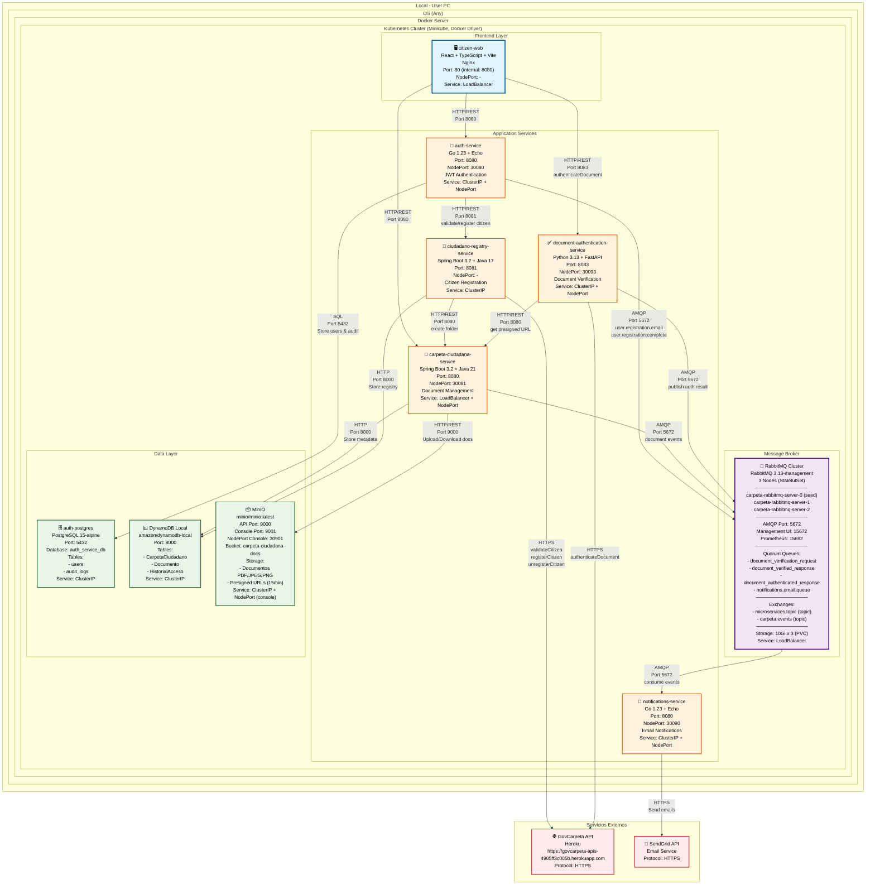

# Carpeta Ciudadana - Monorepo

Sistema nacional de gestión de documentos digitales para Colombia.

## ⚠️ Propósito Educativo

Este proyecto es desarrollado con **fines exclusivamente educativos** como parte del curso **Arquitecturas Avanzadas de Software** de la **Universidad EAFIT**.

**Institución:** Universidad EAFIT
**Curso:** Arquitecturas Avanzadas de Software
**Programa:** Ingeniería de Sistemas / Posgrado
**Objetivo:** Análisis y diseño arquitectónico de un sistema distribuido a escala nacional


Lee nuestra wiki: [Wiki del Proyecto](https://github.com/QuitoTactico/carpeta-ciudadana/wiki)

## Diagrama de Despliegue



## Estructura del Proyecto

```
carpeta_ciudadana/
├── docs/                    # Documentación y análisis arquitectónico
│   ├── ADR/                # Architecture Decision Records
│   └── informacion_cruda/  # Análisis de requerimientos y DDD
├── services/               # Microservicios y aplicaciones
├── libs/                   # Librerías compartidas
├── infrastructure/         # Configuración de infraestructura (Docker, K8s, Terraform)
└── tools/                  # Scripts y herramientas de desarrollo
```

## Directorios Principales

### `docs/`
Toda la documentación del proyecto, incluyendo análisis de dominio, requerimientos funcionales/no funcionales, y decisiones arquitectónicas.

### `services/`
Microservicios y aplicaciones del sistema. Cada servicio será independiente con su propia tecnología.

Ejemplos de servicios futuros:
- API del Operador
- API del Centralizador (MinTIC)
- Aplicación Web Ciudadano
- Aplicación Web Entidad
- Servicio de Autenticación
- Servicio de Notificaciones
- Servicio de Analytics

### `libs/`
Código compartido entre servicios (tipos, modelos, utilidades, etc.).

### `infrastructure/`
Configuración de infraestructura como código (IaC) y contenedores.

### `tools/`
Scripts de automatización, herramientas de desarrollo, y utilidades del proyecto.

## Comenzar

Este es un proyecto académico de diseño arquitectónico. Consulta `CLAUDE.md` para guías de desarrollo y `docs/` para el análisis completo del sistema.

