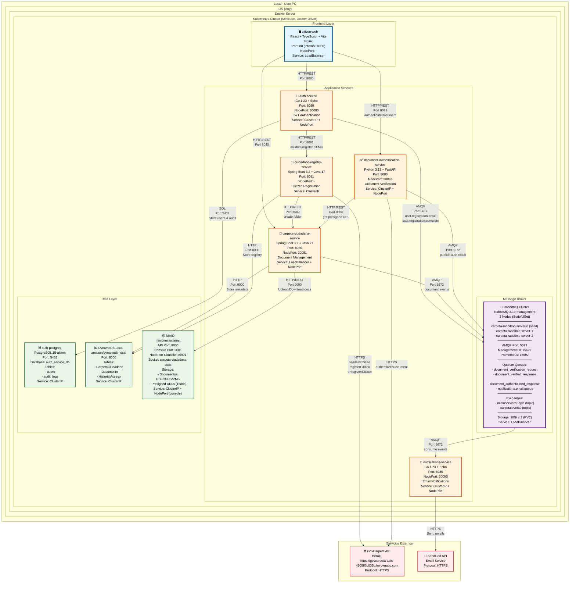
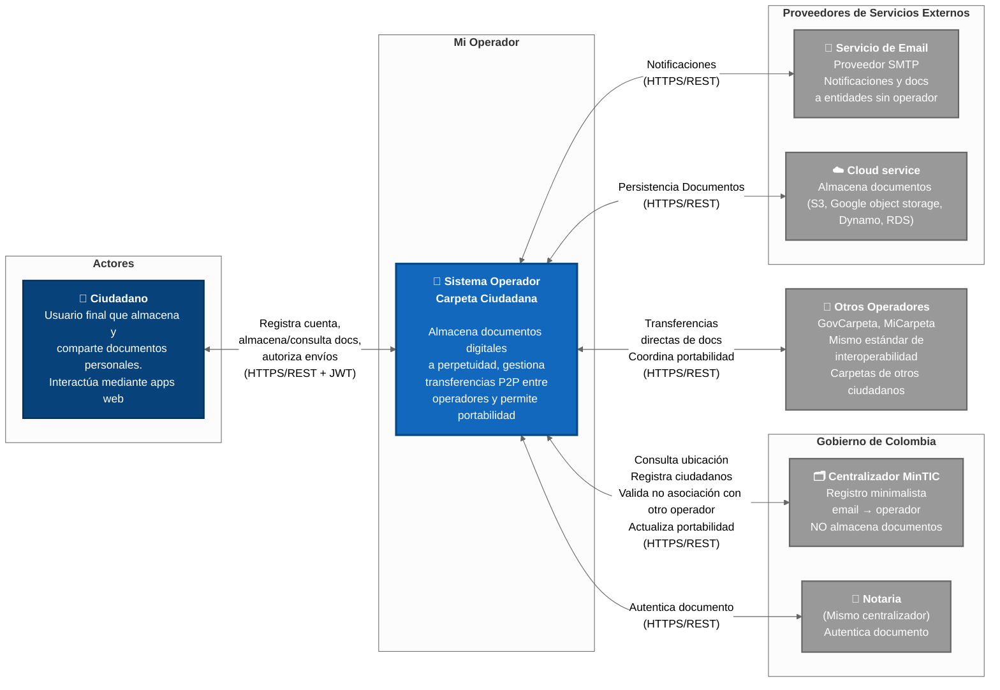
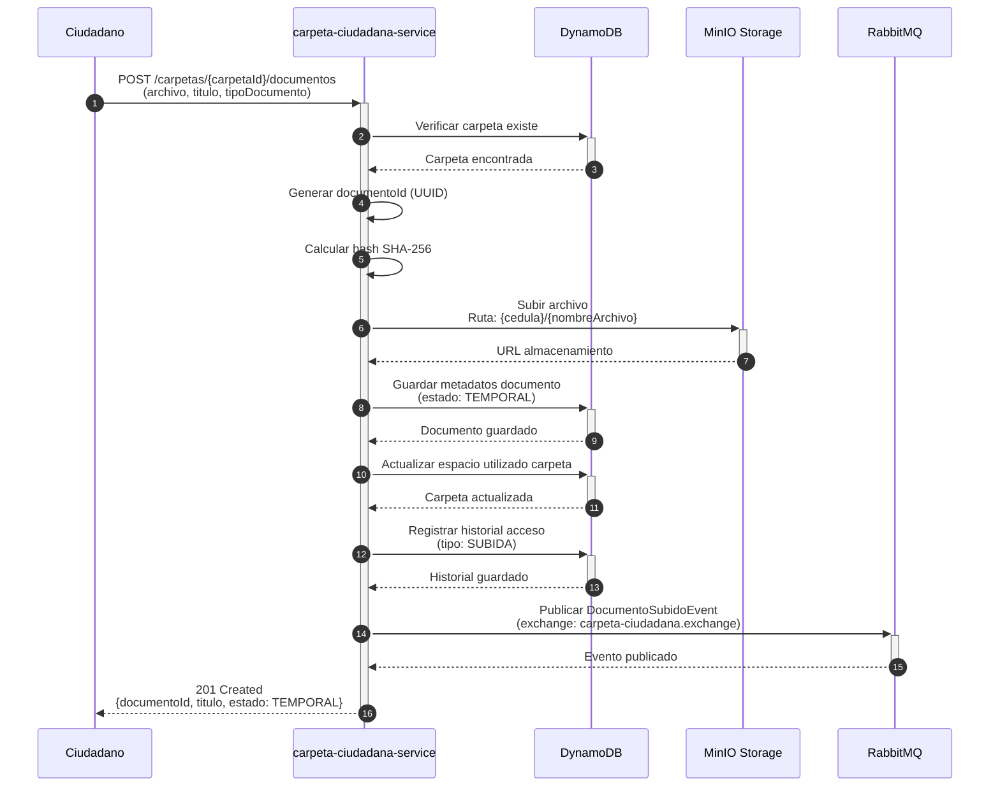
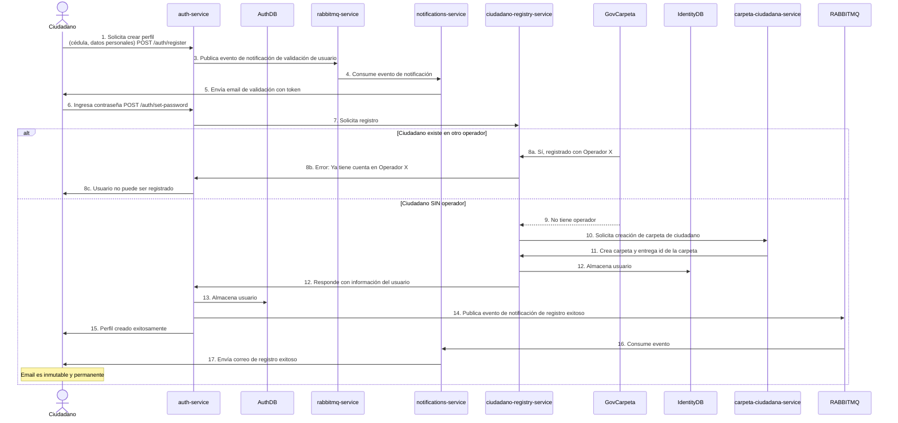
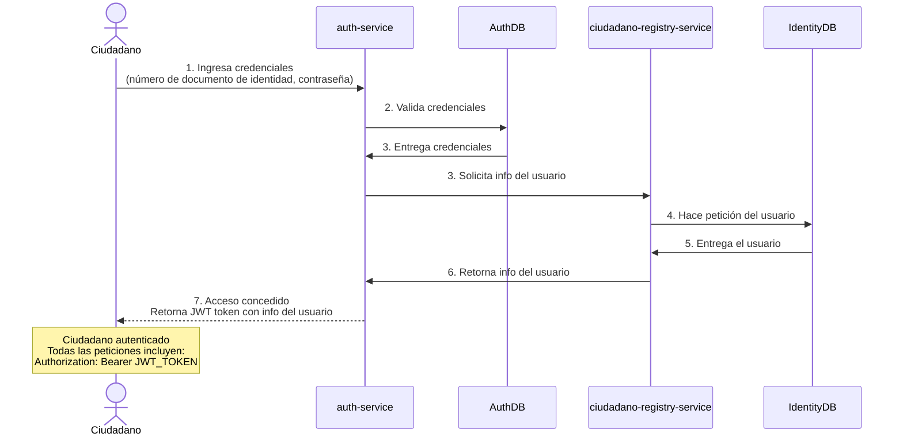
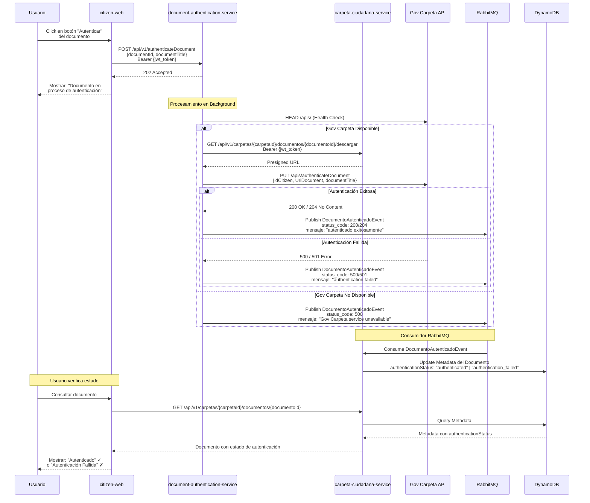

# Carpeta Ciudadana - Monorepo

Sistema nacional de gestión de documentos digitales para Colombia.

**Principio fundamental:** "El ciudadano no debe ser el mensajero del estado"

Esto significa que los ciudadanos no deberían tener que estar llevando físicamente documentos de una entidad a otra. En su lugar, el sistema permite compartir documentos digitalmente de forma segura.

**Por ejemplo:**
Imagina que actualmente necesitas llevar tu diploma físico a 5 lugares diferentes. Con Carpeta Ciudadana, subes el diploma una vez y lo compartes electrónicamente con quien necesites, sin moverte de tu casa.

## ⚠️ Propósito Educativo

Este proyecto es desarrollado con **fines exclusivamente educativos** como parte del curso **Arquitecturas Avanzadas de Software** de la **Universidad EAFIT**.

**Institución:** Universidad EAFIT  
**Curso:** Arquitecturas Avanzadas de Software  
**Programa:** Ingeniería de Sistemas / Posgrado  
**Objetivo:** Análisis y diseño arquitectónico de un sistema distribuido a escala nacional

### Integrantes

- Edward Alejandro Rayo Cortes
- Pascual Gomez Londoño
- Sebastian Restrepo Ortiz
- Esteban Vergara Giraldo

### Enlaces

- Wiki del Proyecto: [https://github.com/QuitoTactico/carpeta-ciudadana/wiki](https://github.com/QuitoTactico/carpeta-ciudadana/wiki)
- Repositorio Original: [https://github.com/edwaraco/carpetaCiudadana](https://github.com/edwaraco/carpetaCiudadana)
- Draft Docs: [https://github.com/edwaraco/carpetaCiudadana/tree/main/docs](https://github.com/edwaraco/carpetaCiudadana/tree/main/docs)

## Diagrama de Despliegue



## Contenido del Proyecto

### Backlog e Historias de Usuario

El backlog del proyecto se gestiona mediante GitHub Projects:
- **Backlog**: [https://github.com/users/edwaraco/projects/2/views/2](https://github.com/users/edwaraco/projects/2/views/2)
- Todas las funcionalidades se manejan como Pull Requests con descripciones detalladas
- Las definiciones de funcionalidades también están documentadas en los ADR con sus respectivos diagramas y flujos

### Architecture Decision Records (ADR)

Los registros de decisiones arquitectónicas se encuentran en [docs/ADR/](./docs/ADR/), incluyendo:
- Selección de patrones de arquitectura
- Decisiones de tecnologías implementadas
- Configuraciones de despliegue
- Estrategias de escalabilidad y resiliencia

<details>
<summary><strong>📋 Ver Requisitos Funcionales (Click para expandir)</strong></summary>

## Requisitos Funcionales

Este documento se enfoca en los siguientes casos de uso críticos:

1. **Crear Ciudadano** - Registro inicial usando APIs de MinTIC (`/apis/registerCitizen`, `/apis/validateCitizen`)
2. **Autenticación de Usuarios** - Login básico con JWT
3. **Subir Documentos** - Almacenamiento de documentos certificados y temporales
4. **Autenticar/Firmar Documentos** - Autenticación usando `/apis/authenticateDocument` de MinTIC
5. **Transferencia de Operador** - Portabilidad usando APIs de MinTIC (`/apis/getOperators`, `/apis/registerTransferEndPoint`)

### 1. Crear Ciudadano

**Bounded Context:** Identidad y Registro  
**Aggregate Root:** RegistroCiudadano  
**Propósito:** Gestionar el registro inicial y creación de carpeta personal

---

**FR-CU-01: Registro Inicial de Ciudadano**

**Como** ciudadano colombiano  
**Quiero** registrarme en el sistema  
**Para** obtener mi carpeta ciudadana y ID único permanente

**Criterios de Aceptación:**

- ✅ El sistema debe validar que el ciudadano no esté registrado usando `/apis/validateCitizen/{id}`
- ✅ El sistema debe registrar al ciudadano usando `/apis/registerCitizen` con:
  - `id`: Identificación del ciudadano (número)
  - `name`: Nombre completo del ciudadano
  - `address`: Dirección del ciudadano
  - `email`: Email del ciudadano
  - `operatorId`: ID del operador actual
  - `operatorName`: Nombre del operador
- ✅ El sistema debe crear la carpeta del ciudadano con identificador único (UUID interno)
- ✅ El sistema debe manejar respuesta 201 (éxito) o 501 (ya registrado)
- ✅ El sistema debe mantener registro de auditoría del proceso

**Fuente:** Swagger MinTIC - `/apis/registerCitizen`

---

**FR-CU-02: Validación de Ciudadano Existente**

**Como** operador  
**Quiero** validar si un ciudadano ya está registrado en el sistema  
**Para** evitar registros duplicados

**Criterios de Aceptación:**

- ✅ El sistema debe consultar `/apis/validateCitizen/{id}` con la identificación del ciudadano
- ✅ El sistema debe manejar respuesta 200 (ciudadano disponible) o 204 (ya registrado)
- ✅ El sistema debe manejar errores 501 (parámetros incorrectos) y 500 (error de aplicación)
- ✅ El sistema debe registrar el resultado de la validación
- ✅ El sistema debe proceder con el registro solo si el ciudadano está disponible

**Fuente:** Swagger MinTIC - `/apis/validateCitizen/{id}`

---

**FR-CU-03: Desregistro de Ciudadano**

**Como** operador  
**Quiero** desregistrar un ciudadano de mi operador  
**Para** permitir transferencia a otro operador

**Criterios de Aceptación:**

- ✅ El sistema debe usar `/apis/unregisterCitizen` con:
  - `id`: Identificación del ciudadano
  - `operatorId`: ID del operador actual
  - `operatorName`: Nombre del operador
- ✅ El sistema debe manejar respuesta 201 (desregistrado exitosamente) o 204 (sin contenido)
- ✅ El sistema debe manejar errores 501 (parámetros incorrectos) y 500 (error de aplicación)
- ✅ El sistema debe mantener backup de datos por 30 días adicionales
- ✅ El sistema debe registrar el proceso de desregistro en auditoría

**Fuente:** Swagger MinTIC - `/apis/unregisterCitizen`

### 2. Autenticación de Usuarios

**Bounded Context:** Autenticación y Autorización  
**Aggregate Root:** SesionUsuario  
**Propósito:** Proteger acceso seguro al sistema

---

**FR-AU-01: Autenticación de Ciudadanos**

**Como** ciudadano  
**Quiero** autenticarme de forma segura  
**Para** acceder a mi carpeta personal

**Criterios de Aceptación:**

- ✅ El sistema debe implementar autenticación básica con usuario y contraseña
- ✅ El sistema debe generar tokens JWT con expiración
- ✅ El sistema debe invalidar sesiones después de inactividad
- ✅ El sistema debe registrar todos los intentos de autenticación (exitosos y fallidos)
- ✅ El sistema debe requerir re-autenticación para acciones sensibles
- ✅ El sistema debe validar credenciales contra base de datos local

**Fuente:** Caso de estudio página 3 - "debe haber un mecanismo sólido de autenticación"

---

**FR-AU-03: Control de Acceso Granular**

**Como** sistema  
**Quiero** implementar control de acceso complejo  
**Para** evitar accesos no autorizados

**Criterios de Aceptación:**

- ✅ El sistema debe implementar permisos a nivel de documento
- ✅ Solo el propietario puede ver sus documentos por defecto
- ✅ Entidades solo pueden ver documentos explícitamente compartidos
- ✅ El sistema debe implementar time-based access (acceso temporal)
- ✅ El sistema debe implementar purpose-based access (acceso por propósito específico)
- ✅ El sistema debe prevenir modificaciones no autorizadas
- ✅ El sistema debe implementar principio de menor privilegio

**Fuente:** Caso de estudio página 3 - "debe haber complejos sistemas de autorización para evitar que las personas no autorizadas vean o modifiquen los documentos"

---

**FR-AU-04: Auditoría de Seguridad**

**Como** operador  
**Quiero** mantener logs de auditoría de todas las operaciones de seguridad  
**Para** cumplir con requisitos regulatorios

**Criterios de Aceptación:**

- ✅ El sistema debe registrar todos los accesos a documentos
- ✅ El sistema debe registrar todas las autorizaciones otorgadas/revocadas
- ✅ El sistema debe registrar todos los cambios de permisos
- ✅ Los logs deben ser inmutables
- ✅ Los logs deben conservarse por mínimo 5 años
- ✅ El sistema debe permitir consulta de logs por período y usuario
- ✅ El sistema debe generar reportes de auditoría

**Fuente:** Caso de estudio - implícito por requisitos de seguridad

### 3. Subir Documentos

**Bounded Context:** Carpeta Personal  
**Aggregate Root:** CarpetaCiudadano  
**Propósito:** Gestionar almacenamiento de documentos certificados y temporales

---

**FR-SD-01: Almacenamiento de Documentos Certificados**

**Como** ciudadano  
**Quiero** almacenar documentos certificados (firmados digitalmente)  
**Para** mantenerlos a perpetuidad sin límite de tamaño

**Criterios de Aceptación:**

- ✅ El sistema debe aceptar documentos firmados digitalmente
- ✅ NO debe existir límite de tamaño para documentos certificados
- ✅ El sistema debe almacenar los metadatos asociados:
  - Clasificación: Tipo de documento (CEDULA, DIPLOMA, ACTA_GRADO, etc.)
  - Identificación: Título, número de documento
  - Contexto: EDUCACION, NOTARIA, REGISTRADURIA, SALUD, etc.
  - Entidad avaladora: Quién certifica el documento
  - Fechas: Emisión, vigencia, recepción
  - Tags: Etiquetas adicionales para búsqueda
- ✅ El sistema debe preservar la firma digital junto con el documento
- ✅ El sistema debe calcular y almacenar el hash SHA-256 del documento
- ✅ El sistema debe asignar UUID único a cada documento
- ✅ El sistema debe validar la integridad del documento antes de almacenar

**Tipos de documentos certificados:**

- Documentos de identidad (Registraduría)
- Diplomas y actas de grado (Instituciones educativas)
- Certificaciones de alergias
- Escrituras
- Declaraciones de renta
- Información de participación en sociedades

**Fuente:** Caso de estudio página 3 - "se espera que todos los documentos certificados puedan mantenerse sin importar su tamaño"

---

**FR-SD-03: Recepción de Documentos por Ciudadano**

**Como** ciudadano  
**Quiero** recibir documentos en mi carpeta o por email  
**Para** acceder a documentos enviados por entidades

**Criterios de Aceptación:**

- ✅ **Si el ciudadano está registrado en un operador:**
  - Los documentos deben transferirse P2P entre operadores
  - Los documentos deben aparecer automáticamente en la carpeta del ciudadano
- ✅ **Si el ciudadano NO está registrado en ningún operador:**
  - Los documentos deben enviarse por correo electrónico tradicional
  - El sistema debe usar el email del ciudadano registrado en MinTIC
- ✅ El sistema debe consultar MinTIC para determinar si el ciudadano tiene operador
- ✅ El sistema debe extraer y almacenar metadatos del documento
- ✅ El sistema debe generar notificación de documento recibido
- ✅ El sistema debe mantener el documento en cola si la carpeta está en proceso de portabilidad
- ✅ El sistema debe rechazar documentos de remitentes no autorizados

**Fuente:** Caso de estudio página 2 - "de lo contrario, le llegarán por correo electrónico"

---

**FR-SD-04: Visualización y Descarga de Documentos**

**Como** ciudadano  
**Quiero** visualizar y descargar mis documentos  
**Para** acceder a ellos cuando los necesite

**Criterios de Aceptación:**

- ✅ El sistema debe permitir visualizar documentos sin descargarlos (vista previa)
- ✅ El sistema debe permitir descargar documentos individuales
- ✅ Los documentos descargados deben mantener su firma digital
- ✅ El sistema debe soportar formatos: PDF, JPEG, PNG
- ✅ El sistema debe validar la integridad del documento antes de descarga (verificación de hash)
- ✅ El sistema debe registrar cada acceso en el historial de accesos
- ✅ El sistema debe generar URLs pre-firmadas con expiración para descargas seguras

**Fuente:** Caso de estudio página 2 - "Andrés podrá descargarlos para imprimirlos, o dejarlos allí para su archivo a perpetuidad"

### 4. Autenticar/Firmar Documentos

**Bounded Context:** Firma y Certificación  
**Aggregate Root:** DocumentoCertificado  
**Propósito:** Garantizar autenticidad legal de documentos

---

**FR-AF-01: Autenticación de Documentos**

**Como** entidad institucional  
**Quiero** autenticar documentos usando el servicio de MinTIC  
**Para** garantizar su autenticidad legal

**Criterios de Aceptación:**

- ✅ El sistema debe usar `/apis/authenticateDocument` con:
  - `idCitizen`: Identificación del ciudadano destinatario
  - `UrlDocument`: URL del documento a autenticar (ej: S3)
  - `documentTitle`: Título del documento
- ✅ El sistema debe manejar respuesta 200 con mensaje de confirmación
- ✅ El sistema debe manejar errores 204 (sin contenido), 501 (parámetros incorrectos) y 500 (error de aplicación)
- ✅ El sistema debe mantener trazabilidad de qué funcionario solicitó la autenticación
- ✅ El sistema debe almacenar documentos autenticados con metadatos de autenticación
- ✅ El sistema debe registrar el proceso de autenticación en auditoría

**Fuente:** Swagger MinTIC - `/apis/authenticateDocument`

### 5. Transferencia de Operador

**Bounded Context:** Gestión de Portabilidad  
**Aggregate Root:** ProcesoPortabilidad  
**Propósito:** Gestionar cambio de operador manteniendo identidad permanente

---

**FR-TO-01: Consulta de Operadores Disponibles**

**Como** operador  
**Quiero** consultar la lista de operadores disponibles  
**Para** facilitar transferencias de ciudadanos

**Criterios de Aceptación:**

- ✅ El sistema debe usar `/apis/getOperators` para obtener lista de operadores
- ✅ El sistema debe manejar respuesta 200 con array de operadores
- ✅ El sistema debe manejar errores 501 (parámetros incorrectos) y 500 (error de aplicación)
- ✅ El sistema debe cachear la lista de operadores para optimizar rendimiento
- ✅ El sistema debe actualizar cache periódicamente

**Fuente:** Swagger MinTIC - `/apis/getOperators`

---

**FR-TO-02: Registro de Endpoints de Transferencia**

**Como** operador  
**Quiero** registrar mis endpoints para recibir transferencias  
**Para** permitir transferencias P2P entre operadores

**Criterios de Aceptación:**

- ✅ El sistema debe usar `/apis/registerTransferEndPoint`
- ✅ El sistema debe manejar respuesta 201 (actualizado exitosamente)
- ✅ El sistema debe manejar errores 501 (parámetros incorrectos) y 500 (error de aplicación)
- ✅ El sistema debe registrar endpoints en formato estándar
- ✅ El sistema debe mantener actualizados los endpoints de transferencia

**Fuente:** Swagger MinTIC - `/apis/registerTransferEndPoint`

---

**FR-TO-04: Proceso Completo de Transferencia de Ciudadano**

**Como** operador origen  
**Quiero** transferir un ciudadano a otro operador manteniendo integridad de datos  
**Para** completar la portabilidad sin pérdida de información

**Criterios de Aceptación:**

**Transferencia de Datos:**

- ✅ El sistema debe desregistrar al ciudadano usando `/apis/unregisterCitizen`
- ✅ El sistema debe transferir datos directamente al operador destino usando su `transferAPIURL`
- ✅ El sistema debe registrar al ciudadano en el operador destino usando `/apis/registerCitizen`
- ✅ El sistema debe exportar TODOS los documentos (certificados y temporales)
- ✅ El sistema debe exportar TODOS los metadatos
- ✅ El sistema debe validar integridad de todos los documentos transferidos

**Gestión de Documentos en Tránsito:**

- ✅ Los documentos enviados durante portabilidad deben encolarse
- ✅ Una vez completada la portabilidad, documentos deben entregarse al nuevo operador
- ✅ NO debe haber pérdida de documentos durante la transición
- ✅ El sistema debe notificar al ciudadano si hay documentos pendientes de entrega
- ✅ El sistema debe mantener cola temporal durante portabilidad
- ✅ El sistema debe validar entrega de documentos pendientes

**Fuente:** Swagger MinTIC - combinación de endpoints de registro/desregistro + DDD análisis

---

**FR-TO-05: Registro de Operador**

**Como** operador  
**Quiero** registrarme en el sistema MinTIC  
**Para** poder operar en el ecosistema de carpeta ciudadana

**Criterios de Aceptación:**

- ✅ El sistema debe usar `/apis/registerOperator`
- ✅ El sistema debe manejar respuesta 201 con ID del operador generado
- ✅ El sistema debe manejar errores 501 (parámetros incorrectos) y 500 (error de aplicación)
- ✅ El sistema debe almacenar el ID del operador para futuras operaciones

**Fuente:** Swagger MinTIC - `/apis/registerOperator`

</details>

<details>
<summary><strong>📊 Ver Requisitos No Funcionales (Click para expandir)</strong></summary>

## Requisitos No Funcionales (QoS)

Este documento define los Requisitos No Funcionales (RNF) o atributos de Calidad de Servicio (QoS) que el sistema debe cumplir para operar como un proveedor certificado del gobierno, garantizando el cumplimiento normativo y la estabilidad a escala nacional.

**Principio de Calidad**: Los RNF deben ser cuantificables, verificables y no negociables para los dominios Core y Supporting.

### Clasificación de Atributos (QoS)

Los RNF se organizan en categorías clave para Arquitecturas Avanzadas:

- Disponibilidad/Resiliencia
- Escalabilidad/Rendimiento
- Seguridad/Confidencialidad
- Mantenibilidad/Eficiencia

### 1. Disponibilidad y Resiliencia

**Propósito:** Garantizar el acceso 24/7 a documentos críticos e inmutabilidad de datos.

|  ID  |	Métrica |	Criterio de Aceptación (QoS) |	Prioridad |
|----------|----------|----------|----------|
| RNF-01 |	Disponibilidad (Uptime) |	99.99% para el Core Domain (Carpeta Personal, Transferencia, Identidad). |	Crítica |
| RNF-02 |	Tiempo de Recuperación (RTO) |	El tiempo máximo para restaurar el servicio después de una caída total debe ser menor a 60 minutos. |	Alta |
| RNF-03 |	Pérdida de Datos (RPO) |	La pérdida máxima de datos aceptada (transacciones) debe ser menor a 5 minutos. |	Crítica |
| RNF-04 |	Tolerancia a Fallos |	El sistema debe ser resiliente al fallo de una región completa (o un centro de datos principal) sin interrupción del servicio. |	Alta |
| RNF-05 |	Respaldo de Documentos |	Se debe realizar copia de seguridad diaria de todos los documentos y metadatos, con retención mínima de 5 años. |	Alta |

### 2. Escalabilidad

**Propósito:** Soportar la demanda masiva de la ciudadanía.

| ID | Métrica | Criterio de Aceptación (QoS)  |	Prioridad |
|----------|----------|----------|----------|
| RNF-06 |	Volumen de Usuarios |	El sistema debe diseñarse para manejar el registro y almacenamiento de datos de 55 millones de ciudadanos (100% de la población objetivo) a largo plazo. |	Alta |
| RNF-07 |	Usuarios Concurrentes | El sistema debe soportar picos de 660.000 usuarios concurrentes activos (basado en el 1% de la población total más un margen de diseño del 20%). |	Alta |
| RNF-08 |	Volumen de Transferencias |	Capacidad para gestionar picos de 5 millones de transferencias de documentos al día (un promedio de ≈1.25 transacciones por usuario activo diario). |	Alta |
| RNF-09 |	Escalado Horizontal |	Todos los componentes del Core Domain deben ser escalables horizontalmente (añadiendo nodos sin límite teórico). |	Alta |
| RNF-10 |	Almacenamiento |	La infraestructura debe proveer almacenamiento ilimitado (limitless storage) para documentos certificados. |	Crítica |

### 3. Rendimiento y Latencia

**Propósito:** Asegurar que los procesos de Seguridad Crítica (cifrado, validación de firmas, MFA) tengan tiempo suficiente para ejecutarse, aceptando una mayor latencia.

| ID | Métrica | Criterio de Aceptación (QoS)  |	Prioridad |
|----------|----------|----------|----------|
| RNF-11 |	API Crítica (p95) |	El 95% de las respuestas de las APIs del Core Domain (Visualización, Autorización, que requieren verificación de firma/MFA) deben ser menores a 600 ms. |	Alta |
| RNF-12 |	Consulta Centralizador (p95) |	El 95% de las consultas al Service Registry del MinTIC deben ser menores a 150 ms. |	Alta |
| RNF-13 |	Tiempo de Transferencia |	La transferencia P2P de documentos debe ser menor a 8 segundos para archivos de hasta 10MB. |	Alta |
| RNF-14 |	Transacciones por Segundo |	El sistema debe ser capaz de procesar 2.000 transacciones por segundo (TPS) en la capa de persistencia de metadatos. |	Media |

### 4. Seguridad

**Propósito:** Reforzar los aspectos de confidencialidad, autorización compleja y mecanismo de autenticación sólido elevándolos a estándares de "No Negociable" y endureciendo las métricas.

| ID | Métrica | Criterio de Aceptación (QoS)  |	Prioridad |
|----------|----------|----------|----------|
| RNF-15 |	Cifrado en Reposo |	Todos los documentos y metadatos deben ser cifrados en reposo usando AES-256 o superior. |	Crítica |
| RNF-16 |	Cifrado en Tránsito |	Toda la comunicación externa e interna debe usar TLS 1.3 o superior. |	Crítica |
| RNF-17 |	Autenticación |	La autenticación del ciudadano debe ser Multi-Factor Obligatoria (MFA) usando al menos un factor biométrico o certificado digital, con sesiones limitadas a 15 minutos de inactividad. |	No Negociable |
| RNF-18 |	Auditoría (Inmutabilidad) |	El historial de accesos y el log de auditoría de seguridad deben ser inmutables y conservarse por mínimo 5 años. |	Crítica |
| RNF-19 |	Cumplimiento Legal |	El sistema debe ser certificado bajo la norma ISO 27001, cumplir con Habeas Data y someterse a pruebas de penetración externas trimestrales. |	No Negociable |
| RNF-20 |	Autorización (Granular) |	El control de acceso debe ser granular a nivel de documento y basarse en el consentimiento explícito. La revocación de permisos debe ser inmediata. |	Crítica |

### 5. Mantenibilidad

**Propósito:** Facilitar la evolución y el soporte de la plataforma a largo plazo.

| ID | Métrica | Criterio de Aceptación (QoS)  |	Prioridad |
|----------|----------|----------|----------|
| RNF-21 |	Tiempo Medio de Reparación (MTTR) |	El tiempo promedio para desplegar una corrección de un error crítico (bug) en producción debe ser menor a 4 horas. |	Alta |
| RNF-22 |	Cobertura de Pruebas |	El código del Core Domain debe tener una cobertura de pruebas unitarias superior al 85%. |	Media |
| RNF-23 |	Modificabilidad |	La adición de un nuevo tipo de documento debe requerir la modificación de menos de 3 componentes principales. |	Media |
| RNF-24 |	Documentación |	La documentación arquitectónica (ADR, C4 Model) debe mantenerse sincronizada al 100% con la implementación. |	Media |

### 6. Usabilidad y Accesibilidad

**Propósito:** Democratizar el acceso a los servicios digitales.

| ID | Métrica | Criterio de Aceptación (QoS)  |	Prioridad |
|----------|----------|----------|----------|
| RNF-25 |	Adopción (Tasa de Éxito) |	El 90% de los usuarios que inicien un flujo principal (ej. compartir documento) deben completarlo sin contactar soporte. |	Alta |
| RNF-26 |	Tiempo de Tarea |	El tiempo promedio para completar la tarea principal (Autorización de Envío) debe ser menor a 30 segundos. |	Alta |
| RNF-27 |	Accesibilidad |	Las interfaz gráfica debe cumplir con las Pautas de Accesibilidad para el Contenido Web WCAG 2.1 Nivel AA. |	Media |

### 7. Eficiencia (Arquitectónica)

**Propósito:** Cumplir con la restricción de diseño del Centralizador MinTIC.

| ID | Métrica | Criterio de Aceptación (QoS)  |	Prioridad |
|----------|----------|----------|----------|
| RNF-28 |	Ratio de Consultas |	El 95% de las consultas de ubicación deben ser resueltas por el caché local del operador (solo el 5% o menos debe ir al Centralizador MinTIC). |	Alta |
| RNF-29 |	Volumen de Datos a MinTIC |	La transferencia de datos hacia y desde el Centralizador MinTIC (Registry) debe limitarse a metadatos de ubicación/identificación (máximo 1KB por transacción). |	Crítica |
| RNF-30 |	Transferencia de Documentos |	El 0% del contenido de documentos o metadatos completos debe pasar por la infraestructura del Centralizador MinTIC. |	Crítica |

### 8. Interoperabilidad

**Propósito:** Asegurar la comunicación fluida y la compatibilidad de datos entre múltiples operadores.

| ID | Métrica | Criterio de Aceptación (QoS)  |	Prioridad |
|----------|----------|----------|----------|
| RNF-31 |	Estándares de Comunicación |	Las APIs de comunicación entre operadores deben usar protocolos estandarizados (RESTful con JSON o gRPC con Protocol Buffers). |	Alta |
| RNF-32 |	Estandarización de Datos |	Los esquemas de metadatos (Clasificación, Identificación) y los formatos de eventos deben estar estandarizados bajo un esquema común (JSON Schema o Avro). |	Alta |
| RNF-33 |	Migración (Portabilidad) |	El proceso de migración de datos de un ciudadano entre dos operadores debe tener una tasa de éxito del 99.9% en la transferencia de documentos y metadatos. |	Alta |

</details>

<details>
<summary><strong>🗺️ Ver Diagrama de Contexto (Click para expandir)</strong></summary>

## Diagrama de Contexto

El diagrama de contexto muestra el sistema Carpeta Ciudadana y cómo interactúa con usuarios y sistemas externos.



### Líneas de Separación (Boundaries)

El diagrama utiliza dos líneas conceptuales para organizar los elementos según las mejores prácticas de C4:

1. **Automation Line** (Línea de Automatización)
   - Separa los **actores humanos** (izquierda) del **sistema automatizado** (centro)
   - Define el límite entre interacciones manuales y procesos automatizados
   - Todo lo que cruza esta línea representa una interacción usuario-sistema

2. **Integration Line** (Línea de Integración)
   - Separa el **sistema principal** (centro) de **otros sistemas externos** (derecha)
   - Define los puntos de integración e interoperabilidad
   - Todo lo que cruza esta línea representa una integración sistema-a-sistema

### Actores Principales (Izquierda - Automation Boundary)

- **Ciudadano**: Usuario final que almacena documentos personales (cédula, diplomas, certificados) y los comparte con entidades cuando lo necesita. Interactúa mediante aplicaciones web/móvil con autenticación multifactor.

### Sistema Principal (Centro)

**Sistema Operador Carpeta Ciudadana**: Plataforma de gestión documental que implementa los requisitos de interoperabilidad definidos por MinTIC. Almacena documentos certificados a perpetuidad sin límite de tamaño, gestiona transferencias P2P directas entre operadores (sin pasar por MinTIC), y permite portabilidad entre operadores en máximo 72 horas.

### Sistemas Externos (Derecha - Integration Boundary)

**1. Gobierno de Colombia**
   - **Centralizador MinTIC**: Registro minimalista que solo mantiene mapeo email → operador actual. NO almacena documentos, NO rutea información. Valida que el ciudadano no esté asociado con otro operador durante el registro. Almacenamiento estimado: 3-5 GB para todo el país (~50M ciudadanos). Responde consultas en <100ms (p95).

**2. Ecosistema de Operadores Privados**
   - **Otros Operadores**: Operadores competidores (ej: GovCarpeta, MiCarpeta) que implementan el mismo estándar de interoperabilidad. Gestionan carpetas de otros ciudadanos/entidades. Las transferencias son **P2P directas** (operador A → operador B) sin pasar por MinTIC. Soportan coordinación de portabilidad con migración completa de datos.

**3. Proveedores de Servicios Externos**
   - **Servicio de Email**: Proveedor SMTP/TLS para notificaciones a ciudadanos y entidades. También se usa para enviar documentos a entidades que no tienen operador (fallback cuando MinTIC responde "entidad sin operador").
   - **Servicios de Nube**: Usado para la persistencia de la información, por ejemplo, donde se guardan los documentos que son subidos por el usuario.

### Flujos Clave de Información

**Transferencia de Documentos:**
1. Operador A consulta a MinTIC: "¿Dónde está ciudadano X?" → MinTIC: "Operador B"
2. Operador A transfiere documentos **DIRECTAMENTE** a Operador B (sin pasar por MinTIC)
3. Operador B confirma recepción (ACK) y notifica al ciudadano

**Portabilidad entre Operadores:**
1. Ciudadano solicita cambio de Operador A → Operador B
2. Operador A exporta TODOS los documentos + metadatos + historial
3. Operador B valida integridad, confirma recepción
4. MinTIC actualiza registro: email → Operador B
5. Proceso completo en máximo 72 horas

</details>

<details>
<summary><strong>🧩 Ver Diagramas de Componentes (Click para expandir)</strong></summary>

## Diagramas de Componentes

### Diagrama de Componentes Lógico


### Diagrama de Componentes Técnico


### Más Diagramas C4

El avance completo de diagramas C4 (Contexto, Contenedores, Componentes) se encuentra en:
- [docs/c4_diagrams.md](./docs/c4_diagrams.md#c4-level-2-container-diagram)

</details>

<details>
<summary><strong>🔄 Ver Diagramas de Secuencia (Click para expandir)</strong></summary>

## Diagramas de Secuencia

Los diagramas de secuencia ilustran las operaciones principales del sistema.

### 1. Registro de Documentos

**Descripción**: Proceso de subida de documentos en el sistema Carpeta Ciudadana. El ciudadano envía un archivo que se almacena en MinIO, se registran los metadatos en DynamoDB, y se publica un evento para procesamiento posterior.



### 2. Crear Perfil de Ciudadano



### 3. Autenticar Usuario/Operadores



### 4. Autenticar Documentos



### Componentes del Sistema

| Componente | Tecnología | Función |
|------------|-----------|---------|
| **citizen-web** | React + Material-UI + Vite | Interfaz web para interacción con ciudadanos |
| **auth-service** | Go + Echo | Autenticación y autorización |
| **carpeta-ciudadana-service** | Java + Spring Boot | API REST para gestión de carpetas y documentos |
| **ciudadano-registry-service** | Java + Spring Boot | Registro y validación de ciudadanos |
| **document-authentication-service** | Python + FastAPI | Orquesta proceso de autenticación de documentos |
| **notifications-service** | Go + Echo | Envío de notificaciones por email |
| **Gov Carpeta API** | Servicio Externo | API gubernamental para validación de documentos |
| **RabbitMQ** | Message Broker (Quorum Queues) | Publica/consume eventos de autenticación |
| **DynamoDB** | NoSQL Database | Almacena metadatos de documentos |
| **PostgreSQL** | SQL Database | Almacena usuarios y auditoría |
| **MinIO** | Object Storage (S3-compatible) | Almacena archivos físicos de documentos |

### Más Diagramas de Secuencia

Diagramas de secuencia adicionales del análisis previo:
- [docs/c4_diagrams.md - Diagramas de Secuencia](https://github.com/edwaraco/carpetaCiudadana/blob/main/docs/c4_diagrams.md#diagramas-de-secuencia---5-escenarios)

</details>

<details>
<summary><strong>📖 Ver Lenguaje Ubicuo (Click para expandir)</strong></summary>

## Lenguaje Ubicuo (DDD)

### Términos Clave del Dominio

| Término | Definición del Dominio | Sinónimos Evitar |
|---------|------------------------|------------------|
| **Carpeta Ciudadana** | Repositorio virtual personal donde se almacenan documentos del ciudadano a perpetuidad | "Sistema", "Plataforma", "Base de datos" |
| **Carpeta Institucional** | Repositorio virtual de una entidad donde almacena documentos emitidos y recibidos | "Cuenta empresarial", "Carpeta de empresa" |
| **Ciudadano** | Persona física registrada en el sistema con cédula válida | "Usuario", "Cliente", "Persona" |
| **Entidad Institucional** | Organización pública o privada (identificada por NIT) registrada en el sistema. Puede actuar con Rol Emisor, Rol Receptor, o ambos simultáneamente | "Empresa", "Institución", "Organización" |
| **Rol Emisor** | Capacidad de una entidad institucional para generar y enviar documentos certificados con firma digital | "Entidad Emisora", "Certificador" |
| **Rol Receptor** | Capacidad de una entidad institucional para solicitar y recibir documentos de ciudadanos | "Entidad Receptora", "Solicitante" |
| **Operador** | Empresa privada o pública que provee infraestructura para gestionar carpetas | "Proveedor", "Vendor", "Hosting" |
| **Centralizador** | Servicio del MinTIC que facilita interoperabilidad entre operadores | "Gateway", "Router central" |
| **Documento Certificado** | Documento firmado digitalmente por entidad avaladora | "Documento oficial", "Documento válido" |
| **Documento Temporal** | Documento subido por ciudadano sin firma de entidad | "Documento no certificado", "Documento borrador" |
| **Firma Digital** | Mecanismo criptográfico que garantiza autenticidad e integridad del documento | "Certificado digital", "Sello digital" |
| **Metadatos** | Información que describe, clasifica y contextualiza un documento | "Información del documento", "Atributos" |
| **Emisión** | Acción de una entidad de generar y enviar documento certificado a ciudadano | "Crear documento", "Publicar documento" |
| **Solicitud de Documentos** | Petición formal de una entidad para que ciudadano comparta documentos específicos | "Pedido", "Request" |
| **Autorización de Envío** | Consentimiento explícito del ciudadano para compartir documentos con entidad | "Permiso", "Aprobación" |
| **Portabilidad** | Transferencia de ciudadano/entidad de un operador a otro | "Migración", "Cambio de operador" |
| **Envío de Documento** | Transferencia de documento de una carpeta a otra | "Compartir", "Transferir" |
| **Almacenamiento a Perpetuidad** | Garantía de que documentos certificados se mantienen indefinidamente | "Permanente", "Para siempre" |
| **Servicio Premium** | Funcionalidad de pago ofrecida por operadores más allá de servicios básicos | "Servicio de pago", "Funcionalidad adicional" |
| **Interoperabilidad** | Capacidad de diferentes operadores de intercambiar documentos y datos | "Compatibilidad", "Integración" |
| **Registraduría** | Entidad del estado que valida identidad de ciudadanos | - |
| **Trámite** | Proceso administrativo para el cual se solicitan/envían documentos | "Proceso", "Gestión" |

### Frases del Lenguaje Ubicuo

**Frases que DEBERÍAN usarse** en conversaciones con expertos del dominio:

- "El ciudadano **autoriza el envío** de documentos a la entidad institucional"
- "La entidad institucional **con rol emisor emite un documento certificado** al ciudadano"
- "La entidad institucional **con rol receptor solicita documentos** al ciudadano para un trámite"
- "La universidad **actúa con ambos roles**: emite diplomas y recibe documentos de candidatos"
- "El operador **gestiona la carpeta** del ciudadano"
- "Los documentos certificados se **almacenan a perpetuidad**"
- "El ciudadano puede **solicitar portabilidad** a otro operador"
- "El centralizador **facilita la interoperabilidad** entre operadores"

**Frases que NO deberían usarse** en conversaciones con expertos del dominio:

- "El usuario sube un archivo al servidor"
- "El sistema guarda el documento en la base de datos"
- "La empresa consulta la API para obtener datos"

</details>

## Implementación

### Tecnologías por Componente

**Frontend**

| Componente | Tecnología | Puerto | Tipo |
|------------|-----------|--------|------|
| citizen-web | React 19 + TypeScript + Vite + Nginx | 80 (8080) | LoadBalancer |

---

**Servicios de Aplicación**

| Servicio | Tecnología | Puerto Interno | NodePort | Tipo |
|----------|-----------|----------------|----------|------|
| auth-service | Go 1.23 + Echo Framework | 8080 | 30080 | ClusterIP + NodePort |
| carpeta-ciudadana-service | Spring Boot 3.2 + Java 21 | 8080 | 30081 | LoadBalancer + NodePort |
| ciudadano-registry-service | Spring Boot 3.2 + Java 17 | 8081 | - | ClusterIP |
| document-authentication-service | Python 3.13 + FastAPI | 8083 | 30093 | ClusterIP + NodePort |
| notifications-service | Go 1.23 + Echo Framework | 8080 | 30090 | ClusterIP + NodePort |

---

**Message Broker**

| Componente | Tecnología | Puertos | Tipo |
|------------|-----------|---------|------|
| RabbitMQ Cluster | RabbitMQ 3.13-management (3 nodos) | AMQP: 5672<br/>Management: 15672<br/>Prometheus: 15692 | LoadBalancer |

---

**Capa de Datos**

| Componente | Tecnología | Puerto | Tipo |
|------------|-----------|--------|------|
| auth-postgres | PostgreSQL 15-alpine | 5432 | ClusterIP |
| dynamodb-local | amazon/dynamodb-local | 8000 | ClusterIP |
| minio | minio/minio:latest | API: 9000<br/>Console: 9001 (NodePort: 30901) | ClusterIP + NodePort |

---

**Servicios Externos**

| Servicio | URL | Protocolo |
|----------|-----|-----------|
| GovCarpeta API | https://govcarpeta-apis-4905ff3c005b.herokuapp.com | HTTPS |
| SendGrid | SendGrid API | HTTPS |

### Protocolos de Comunicación

**HTTP/REST**

- **citizen-web → auth-service**: Autenticación, registro, gestión de perfil
- **citizen-web → carpeta-ciudadana-service**: Gestión de documentos, carpetas
- **auth-service → ciudadano-registry-service**: Validación y registro de ciudadanos
- **carpeta-ciudadana-service → minio**: Upload/Download de documentos
- **carpeta-ciudadana-service → dynamodb-local**: Almacenamiento de metadatos
- **ciudadano-registry-service → carpeta-ciudadana-service**: Creación de carpetas
- **ciudadano-registry-service → dynamodb-local**: Registro de ciudadanos
- **document-authentication-service → carpeta-ciudadana-service**: Obtención de URLs prefirmadas

---

**HTTPS (Servicios Externos)**

- **ciudadano-registry-service → GovCarpeta**: Validación/registro/desregistro de ciudadanos
- **document-authentication-service → GovCarpeta**: Autenticación de documentos
- **notifications-service → SendGrid**: Envío de emails

---

**AMQP (RabbitMQ)**

- **auth-service → RabbitMQ**: Publica eventos de registro de usuario
  - `user.registration.email` (verificación)
  - `user.registration.complete` (bienvenida)
- **carpeta-ciudadana-service → RabbitMQ**: Publica eventos de documentos
- **document-authentication-service → RabbitMQ**: Publica resultados de autenticación
  - `document_authenticated_response`
- **RabbitMQ → notifications-service**: Consume eventos para enviar notificaciones

---

**SQL**

- **auth-service → auth-postgres**: Almacenamiento de usuarios y auditoría

### Colas y Exchanges de RabbitMQ

**Exchanges**

| Exchange | Tipo | Uso |
|----------|------|-----|
| microservices.topic | topic | Eventos generales del sistema |
| carpeta.events | topic | Eventos específicos de carpeta |

---

**Queues**

| Queue | Tipo | Propósito |
|-------|------|-----------|
| document_verification_request | quorum | Solicitudes de verificación |
| document_verified_response | quorum | Respuestas de verificación |
| document_authenticated_response | quorum | Resultados de autenticación |
| notifications.email.queue | quorum | Emails a enviar |

---

**Routing Keys**

- `user.registration.email`: Email de verificación
- `user.registration.complete`: Email de bienvenida
- `document.verified`: Documento verificado
- `document.authenticated`: Documento autenticado

### Almacenamiento

**PostgreSQL (auth-postgres)**

- **users**: Usuarios registrados con contraseñas hasheadas
- **audit_logs**: Auditoría de operaciones de seguridad

---

**DynamoDB Local**

- **CarpetaCiudadano**: Metadatos de carpetas ciudadanas
- **Documento**: Metadatos de documentos (título, tipo, contexto, hash, estado)
- **HistorialAcceso**: Auditoría de accesos a documentos

---

**MinIO**

- **Bucket**: `carpeta-ciudadana-docs`
- **Contenido**: Archivos PDF, JPEG, PNG
- **URLs prefirmadas**: Válidas por 15 minutos
- **Tamaño máximo**: 50MB por archivo

### Notas de Despliegue

1. **Cluster**: Minikube con driver Docker
2. **Namespace**: `carpeta-ciudadana` (todos los servicios)
3. **Image Pull Policy**: `Never` o `IfNotPresent` (imágenes locales)
4. **Persistencia**:
   - RabbitMQ: 10Gi x 3 nodos (PVC)
   - PostgreSQL: EmptyDir (no persistente en esta configuración)
   - MinIO: EmptyDir (no persistente en esta configuración)
5. **Alta Disponibilidad**:
   - RabbitMQ: 3 nodos con Quorum Queues
   - Frontend: 3 réplicas
   - Otros servicios: 3 réplicas también con balanceador de carga
   - Todo puede ser escalado según demanda

## Comenzar

Este es un proyecto académico de diseño e implementación arquitectónica. 

**Para comenzar a desarrollar:**
- Consulta `CLAUDE.md` para guías de desarrollo específicas
- Revisa `docs/` para el análisis completo del sistema y decisiones arquitectónicas
- Lee las guías de despliegue enlazadas arriba para configurar el entorno local

**Para explorar la documentación:**
- [Wiki del Proyecto](https://github.com/QuitoTactico/carpeta-ciudadana/wiki)
- [Documentación de Arquitectura](./docs/)
- [Architecture Decision Records](./docs/ADR/)
- [Diagramas C4](./docs/c4_diagrams.md)

## Diagrama de Despliegue


```
carpeta_ciudadana/
├── docs/                              # Documentación y análisis arquitectónico
│   ├── ADR/                          # Architecture Decision Records
│   ├── informacion_cruda/            # Análisis de requerimientos y DDD
│   ├── c4_diagrams.md                # Diagramas C4 del sistema
│   └── diagrama-despliegue.md        # Diagrama de despliegue detallado
├── services/                          # Microservicios y aplicaciones
│   ├── auth-service/                 # Servicio de autenticación (Go + Echo)
│   ├── carpeta-ciudadana-service/    # Servicio de gestión de documentos (Spring Boot + Java)
│   ├── citizen-web/                  # Frontend web para ciudadanos (React + TypeScript + Vite)
│   ├── ciudadano-registry-service/   # Servicio de registro de ciudadanos (Spring Boot + Java)
│   ├── document-authentication-service/ # Servicio de autenticación de documentos (Python + FastAPI)
│   ├── notifications-service/        # Servicio de notificaciones (Go + Echo)
│   └── rabbitmq-service/             # Configuración del broker de mensajes
├── libs/                              # Librerías compartidas
├── infrastructure/                    # Configuración de infraestructura (Docker, K8s, Terraform)
├── tools/                             # Scripts y herramientas de desarrollo
│   ├── k8s-update-service.ps1        # Script de actualización de servicios (Windows)
│   ├── k8s-update-service.sh         # Script de actualización de servicios (Linux/Mac)
│   ├── port-forwards-start.ps1       # Iniciar port-forwards (Windows)
│   ├── port-forwards-start.sh        # Iniciar port-forwards (Linux/Mac)
│   ├── port-forwards-stop.ps1        # Detener port-forwards (Windows)
│   └── port-forwards-stop.sh         # Detener port-forwards (Linux/Mac)
├── DEPLOYMENT_GUIDE.md                # Guía completa de despliegue
├── DEPLOYMENT_GUIDE_SUMMARY.txt       # Guía rápida de despliegue
└── Makefile                           # Automatización de despliegue
```

## Directorios Principales

### `docs/`
Toda la documentación del proyecto, incluyendo:
- **ADR/**: Registros de decisiones arquitectónicas (Architecture Decision Records)
- **informacion_cruda/**: Análisis de dominio, requerimientos funcionales/no funcionales, y DDD
- **c4_diagrams.md**: Diagramas de contexto, contenedores y componentes
- **diagrama-despliegue.md**: Detalles del diagrama de despliegue

### `services/`
Microservicios y aplicaciones del sistema. Cada servicio es independiente con su propia tecnología:

- **auth-service** (Go 1.23 + Echo): Autenticación JWT, MFA, gestión de sesiones
- **carpeta-ciudadana-service** (Spring Boot 3.2 + Java 21): Gestión de documentos y carpetas ciudadanas
- **citizen-web** (React 19 + TypeScript + Vite): Interfaz web para ciudadanos
- **ciudadano-registry-service** (Spring Boot 3.2 + Java 17): Registro y validación de ciudadanos
- **document-authentication-service** (Python 3.13 + FastAPI): Autenticación de documentos con GovCarpeta
- **notifications-service** (Go 1.23 + Echo): Notificaciones por email vía SendGrid
- **rabbitmq-service** (RabbitMQ 3.13): Broker de mensajes con cluster de 3 nodos

### `libs/`
Código compartido entre servicios (tipos, modelos, utilidades, etc.).

### `infrastructure/`
Configuración de infraestructura como código (IaC):
- Configuraciones de Docker
- Manifiestos de Kubernetes
- Scripts de Terraform (futuro)

### `tools/`
Scripts de automatización, herramientas de desarrollo, y utilidades:
- Scripts de actualización de servicios
- Gestión de port-forwards
- Herramientas de debugging

## Guías de Despliegue

El proyecto incluye guías detalladas para desplegar todo el sistema en Kubernetes:

- **[DEPLOYMENT_GUIDE.md](./DEPLOYMENT_GUIDE.md)**: Guía completa paso a paso con explicaciones detalladas de cada servicio
- **[DEPLOYMENT_GUIDE_SUMMARY.txt](./DEPLOYMENT_GUIDE_SUMMARY.txt)**: Guía rápida de referencia con comandos esenciales
- **Makefile**: Automatización completa del despliegue (recomendado para principiantes)
- **Guías individuales**: Cada servicio tiene su propio README con instrucciones específicas:
  - [services/carpeta-ciudadana-service/DEPLOYMENT_GUIDE.md](./services/carpeta-ciudadana-service/DEPLOYMENT_GUIDE.md)
  - [services/rabbitmq-service/DEPLOYMENT_GUIDE.md](./services/rabbitmq-service/DEPLOYMENT_GUIDE.md)
  - [services/rabbitmq-service/DEPLOYMENT_GUIDE_EXTENDED.md](./services/rabbitmq-service/DEPLOYMENT_GUIDE_EXTENDED.md)
  - [services/document-authentication-service/DEPLOYMENT_GUIDE.md](./services/document-authentication-service/DEPLOYMENT_GUIDE.md)
  - Y más en cada directorio de servicio

### Despliegue Rápido con Makefile

```bash
# Para Windows (PowerShell con privilegios de administrador)
make deploy-windows

# Para Linux/Mac
make deploy-linux
```

El Makefile automáticamente:
1. Despliega el cluster de RabbitMQ
2. Despliega todos los servicios de aplicación
3. Despliega el frontend
4. Configura los port-forwards necesarios
5. Actualiza el archivo hosts

Para más detalles, consulta las guías de despliegue enlazadas arriba.

